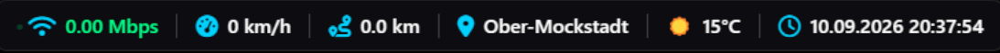
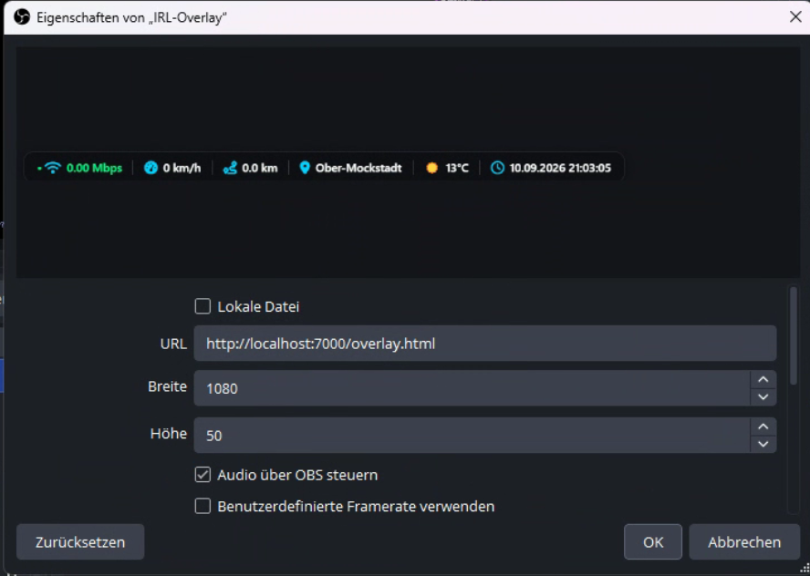

# IRL Stream Overlay

A clean, lightweight browser-based overlay designed for IRL (In Real Life) streaming. It pulls real-time telemetry from a Traccar server and an SRTLA Relay to seamlessly display your current streaming stats, location, and weather directly in OBS Studio.



## Features

*   **Live Connection Status & Bitrate:** Fetched from SRTLA legacy stats.
*   **Current Speed & Distance Tracking:** Calculated dynamically from Traccar position data.
*   **Live Location & Weather:** Derived from Traccar GPS coordinates using reverse geocoding and the Open-Meteo API.
*   **Local Time:** Clean digital clock display.

## Repository Structure

The `irl-overlay` folder contains two main files required for the overlay to function:

*   `overlay.html` - The main visual frontend containing the layout, styling, and core JavaScript logic for polling the APIs.
*   `credentials.js` - A configuration file where you define your specific API endpoints, passwords, and device IDs. 

## Installation & Setup

### 1. Configuration
Open `credentials.js` in a text editor and fill in your details:
*   **SRTLA Stats:** IP address, port (default `3000`), username, and password.
*   **Traccar Backend:** URL, login credentials, and the specific Device ID you want to track.

### 2. Traccar Server Connection
Depending on where your Traccar server is hosted, you have two options:

*   **Local Installation:** If Traccar is running on the same machine, simply use `http://localhost:8082` in your config.
*   **Remote/Cloud Server (Docker/VPS):** If your Traccar instance is hosted externally, it is highly recommended **not** to expose the API port publicly. Instead, secure the connection using an SSH tunnel.
  
  Run the following command on your streaming PC to tunnel the port locally:
  ```bash
  ssh -L 8082:127.0.0.1:8082 -i PATH_TO_YOUR_PRIVATE.key USERNAME@IP
  ```

### 3. Adding to OBS Studio

You can load this overlay into OBS as a standard Browser Source.



1. Add a new **Browser Source** in your OBS scene.
2. **Width/Height:** Set dimensions that fit your stream resolution (e.g., Width: `1080`, Height: `50` or similar based on your layout preference).
3. **Important Checkboxes:** Make sure to check the following options to ensure the overlay doesn't unnecessarily poll APIs when hidden:
   * [x] *Shutdown source when not visible* (Deaktivieren, wenn Quelle nicht sichtbar ist)
   * [x] *Refresh browser when scene becomes active* (Browser bei Szenenwechsel aktualisieren)

#### Handling CORS Issues (Local vs. Web Server)
When loading HTML files locally directly into OBS, modern browser engines strictly enforce CORS (Cross-Origin Resource Sharing) policies, which will block the overlay from fetching data from your SRTLA and Traccar APIs.

**Recommended Solution:** 
Host the `irl-overlay` folder using a dedicated local web server (like Nginx, Apache, or a simple Python/Node HTTP server) and point the OBS Browser Source to that local URL (e.g., `http://localhost:7000/overlay.html`).

**Alternative (Local File):**
If you prefer checking the "Local File" box in OBS, you need to bypass the security restrictions. You can do this by launching OBS Studio with the following command-line argument:
```bash
--disable-web-security
```
*(Note: Use this start parameter at your own risk, as it disables security checks for all browser sources in OBS).*

---

## If not already installed: Setting up Traccar with Docker

If you don't have a Traccar server running yet, the quickest and cleanest way to deploy one is using Docker. 

1. Create a directory for your Traccar setup and navigate into it:
   ```bash
   mkdir traccar && cd traccar
   ```
2. Download the default configuration file:
   ```bash
   wget https://raw.githubusercontent.com/traccar/traccar/master/setup/default.xml -O traccar.xml
   ```
3. Run the Traccar container:
   ```bash
   docker run -d --restart always \
     --name traccar \
     -p 8082:8082 \
     -p 5000-5150:5000-5150 \
     -p 5000-5150:5000-5150/udp \
     -v $(pwd)/logs:/opt/traccar/logs \
     -v $(pwd)/traccar.xml:/opt/traccar/conf/traccar.xml \
     traccar/traccar:latest
   ```
*(Note: If you are running this on a cloud VPS, consider blocking public access to port 8082 via your firewall and using the SSH tunnel method described above for safe local access).*

---

## Contact

**Marc-Oliver Blumenauer**  
Email: [marc@l3c.de](mailto:marc@l3c.de)
